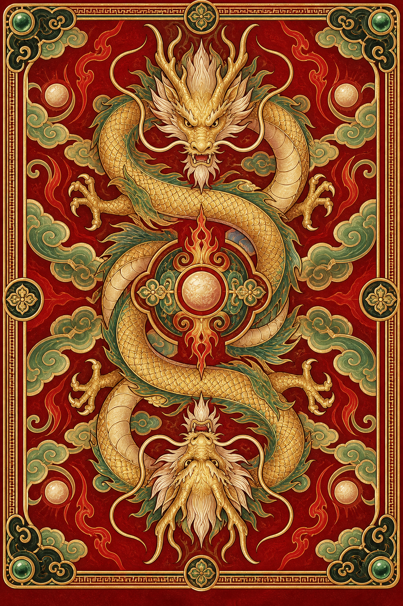

# Mythic UNO

A polished UNO-inspired card game built with Godot 4, featuring Chinese mythology artwork, animated turns, computer-controlled opponents, and clear rule explanations.

<p align="center">
  
</p>

## Features

- Classic 108-card UNO deck for 2–4 players
- Computer-controlled opponents with automatic turn handling
- 30 selectable Chinese mythology character avatars
- Original dragon-themed card back artwork
- Animated dealing, drawing, and card-play transitions
- Adjustable game speed: Relaxed, Normal, or Swift
- Procedurally generated sound effects with a sound toggle
- Clear current-player highlighting and turn announcements
- Clockwise and counterclockwise route display
- Previous-player and next-player indicators
- Prominent draw button when the player has no legal card
- Match scoring with a configurable winning target
- In-game log explaining every played card and its result

## Implemented Rules

The game follows the classic UNO rules, including:

- Match by color, number, or action symbol
- Draw one card when choosing not to play
- A playable drawn card may be played immediately or kept
- Skip, Reverse, and Draw Two effects
- Wild color selection
- Wild Draw Four legality and challenge resolution
- Reverse acting as Skip in a two-player game
- UNO declaration and missed-call penalty
- No card stacking
- Round scoring based on cards left in opponents' hands

Rule reference: [UNO Rules](https://www.unorules.com/)

## Requirements

- [Godot Engine 4.7](https://godotengine.org/) or a compatible Godot 4 release

The project uses GDScript and does not require a separate build system or external runtime dependencies.

## Running the Game

1. Clone the repository:

   ```bash
   git clone https://github.com/yongding422/UNOGame.git
   cd UNOGame
   ```

2. Open `project.godot` in Godot.
3. Press **F6** to run the current scene or **F5** to run the project.
4. Select an avatar, player count, and target score, then start the match.

## How to Play

- Select a highlighted card to play it.
- Use **抓一张牌 / DRAW** to draw from the deck.
- If the drawn card is playable, play it or choose **Keep Card / Pass**.
- Use **CALL UNO!** before playing down to one card.
- For a Wild card, select the next active color.
- When an opponent plays Wild Draw Four against you, accept the penalty or challenge the play.
- Open **Game Log** to review each card's function and actual outcome.

## Project Structure

```text
UNOGame/
├── assets/art/              # Card-back and avatar artwork
├── scripts/
│   ├── card_view.gd         # Card rendering and interaction
│   └── uno_game.gd          # Game rules, AI, UI, animation, and audio
├── tests/
│   └── test_rules.gd        # Rules and regression tests
├── node_2d.tscn             # Main game scene
└── project.godot            # Godot project configuration
```

## Tests

The repository includes regression coverage for:

- Classic deck composition
- Card matching and Wild Draw Four challenge detection
- Scoring values
- Direction changes and two-player behavior
- Animation speed scaling
- Procedural sound generation
- Avatar catalog integrity
- Game-log descriptions and draw-prompt detection

The test suite uses the included Godot AI test runner and can be run from its Godot editor panel.

## Artwork

The card back and character-avatar artwork were created specifically for this project with a Chinese mythology theme.

## Repository

[github.com/yongding422/UNOGame](https://github.com/yongding422/UNOGame)
